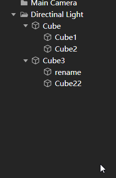

# hierarchy-tree

层级树组件,树结构组件

### Tree 配置
#### config

--  autoDeselect：是否自动反选

--  draggable：是否可以被拖放

--  editable：是否可以编辑

#### Event List 事件列表

• changes.applied - (Tree tree)  -render tree

• data.loaderror - (Error err) -

• node.added - (TreeNode node) -

• node.selected - (TreeNode node) -

• node.deselected - (TreeNode node) -

• node.collapsed - (TreeNode node) -

• node.expanded - (TreeNode node) -

• node.editing - (TreeNode node), (string oldValue) -

• node.edited - (TreeNode node), (string oldValue), (string newValue) -

• node.removed - (TreeNode node) -

• node.click - (MouseEvent event, TreeNode node) -

• node.dblclick - (MouseEvent event, TreeNode node) -

• node.contextmenu - (MouseEvent event, TreeNode node) -

• node.dragover - (TreeNode target, string dir) -["above","insert","below"].

• node.draged - (DragEvent event,TreeNode source) -

• node.droped - (DragEvent event,TreeNode source, TreeNode target，string dir) -

#### 选择逻辑
参考vscode的选择逻辑设计

1.shift会选中当前和上一次ctrl操作的节点（或者唯一选中）的区间，该区间会被记录下来

2.若上一次ctrl操作的节点（包含选择和取消选择）在已知的某个区间中，则shift会对该区域进行调整，重置为上一次ctrl操作节点和当前选中的区间

3.展开和折叠操作不会清除选中状态但是调整选区会改变不可见状态的选中状态（折叠等不可见状态）

4.展开和折叠都会破环选区的判定，选区分割始终与当前的可视状态有关
注：最终未采用unity的做法，1.未正确理解unity的ctrl组合逻辑（可能是由选择序列分区域定义了编辑方向）2.多区域复选是一个优秀（容易理解，额外功能）的特性

#### 拖拽逻辑

拖拽对象为当前选中的所有节点，拖拽过程中每个节点都有above，below，insert三种位置状态，drop会将选中列表节点按照节点的自上而下的位置顺序排列并添加为目标节点的子节点，drag过程中，若停留在未展开的节点上超过1秒，则自动展开该节点

#### 重命名逻辑

若当前树为聚焦状态，且当前点击的节点已经是唯一选中的节点，在鼠标完成click事件的0.3s后，若当前操作被判定为单击事件（0.3s内没有第二次点击），改节点进入编辑状态，文字全部选中，键盘enter操作和esc操作，分别对应重命名的提交和取消，当由于树失焦或者节点失焦造成的该节点退出编辑状态，数据会自动提交

#### 选中逻辑

节点会在mousedown时被选中，并发射选中事件，tree的失焦会让选中状态的样式改变（灰色），重复选中不会发射选中事件，当tree的config.autodeselect属性值为true时，每一次选中都会自动反选已选中节点，当当前为复选状态时,ctrl的状态会反选当前，【shift选择逻辑】

#### 右键逻辑

• 右键会检查当前的一个右键状态，每一次左键都会重置该状态为初始；

• 若是初始状态，且当前右键的节点没有被选中，则执行选中该节点的操作然后执行发射右键事件

• 若不是初始状态或者已经为选中状态，则仅发射右键事件；

#### 检索逻辑

检索方法为tree.searchquery: string | RegExp | Function): Promise<TreeNode[]>{},符合检索规则的节点会高亮处理，并向上展开到根节点，除了符合检索规则的节点和向上展开的各级父节点会被显示，其他节点均隐藏，当检索取消【输入为空或者为空字符串】，还原最近一次检索的状态【主要是展开状态】

